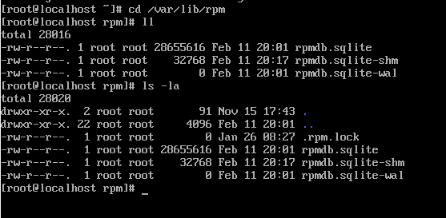

## ¿Dónde se encuentra los repositorios?
En /var/lib/rpm

## Indicar ruta y mostrar el contenido.

## Entre las características de RPM están:

Los paquetes pueden ser cifrados y verificados con GPG y MD5.
Los archivos de código fuente (por ejemplo .tar.gz, .tar.bz2) están incluidos en SRPMs, posibilitando una verificación posterior.
PatchRPMs y DeltaRPMs, que son equivalentes a ficheros parche, pueden actualizar incrementalmente los paquetes RPM instalados.
Las dependencias pueden ser resueltas automáticamente por el gestor de paquetes.
# Algunos Comandos:

rpm -qa = muestra paquetes instalados.

rpm -qi foo = muestra la información de un paquete RPM.

rpm -ql foo = lista ficheros de un paquete RPM instalado.

rpm -qc foo = lista solo los ficheros de configuración.

rpm --checksig foo = verifica firma de un paquete RPM.

rpm -ivh "localFile.rpm" = instala un paquete.

rpm -e "localFile.rpm" = desinstala un paquete.
